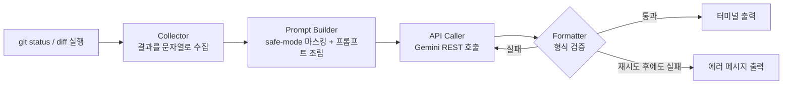

# Git AI Helper

`git status` / `git diff` 결과를 AI API에 넘겨 커밋 메시지와 PR 초안을 자동 생성하는 CLI 도구입니다.

---

## 왜 필요한가

커밋 메시지와 PR 설명은 매번 작성해야 하지만, 작성 자체보다 **"무슨 내용을 어떤 형식으로 담을지 정리하는 시간"**이 더 오래 걸립니다.

이 도구는 그 정리 과정을 AI에게 위임합니다. 다만 AI 응답을 그대로 믿지 않고,

- 입력 단계에서 민감정보(API Key, 이메일 등)를 마스킹하고
- 출력 단계에서 실무 규칙(제목 길이, 섹션 구조)을 만족하는지 검증하고
- 검증 실패 시 1회 재시도 후 명확히 실패를 알리는

**"AI 출력을 신뢰하지 않고 검증하는 파이프라인"**을 구현하는 것이 이 프로젝트의 핵심입니다. 단순히 API를 호출하는 게 아니라, 비정형 텍스트(diff)를 정형 데이터(커밋/PR 스키마)로 강제 변환하는 구조를 만드는 데 목적이 있습니다.

---

## 전체 흐름



변경사항이 없으면 Collector 단계에서 바로 종료되고, 재시도는 `MAX_RETRIES = 1`로 딱 한 번만 허용합니다 (과제 제약: 실행당 API 호출 1~2회 이내 권장).

---

## 파일 구조 및 핵심 함수

### `collector.py` — Git 변경사항 수집

```python
def get_git_status() -> str
def get_git_diff() -> str
def get_current_branch() -> str
```

- `subprocess.run(..., capture_output=True, text=True)`로 git 명령 결과를 바로 파이썬 문자열로 받습니다. 별도 파싱 없이 다음 레이어(Prompt Builder)에 그대로 넘길 수 있게 하기 위함입니다.
- `get_current_branch()`는 PR 프롬프트에만 필요해서 Collector에 별도 함수로 분리했습니다. commit 흐름에는 영향 없이 재사용 가능합니다.

### `prompt_builder.py` — 비정형 diff → 프롬프트 조립

```python
def mask_sensitive(diff_text: str) -> str
def build_commit_prompt(status: str, diff: str, safe_mode: bool) -> str
def build_pr_prompt(status: str, diff: str, branch_name: str, safe_mode: bool) -> str
```

- `mask_sensitive()`는 20자 이상이면서 숫자를 하나라도 포함한 영숫자 문자열(API Key/Token 패턴)과 이메일 패턴을 정규식으로 치환합니다. 숫자 포함 여부를 조건에 넣은 이유는, `connect_external_api`처럼 20자를 넘는 함수명/변수명(순수 문자로만 구성)까지 키로 오인해 마스킹되는 것을 막기 위함입니다. `safe_mode=True`일 때만 적용되며, 두 프롬프트 함수가 공통으로 호출합니다.
- 프롬프트 안에 출력 형식(제목 길이 제한, PR의 `## Why/What/How to Test` 헤더)을 명시적으로 못박아둔 이유는, AI가 "대략 알아서" 형식을 맞추게 두면 매 실행마다 결과가 달라지기 때문입니다. 프롬프트 제약은 1차 방어선이고, 최종 판단은 Formatter가 합니다.
- `build_pr_prompt()`에서 `PR_TITLE:` / `PR_BODY:` 프리픽스를 강제한 이유는, Formatter에서 정규식 하나로 제목과 본문을 분리할 수 있게 하기 위함입니다 (파싱 편의를 프롬프트 설계 단계에서 미리 고려).

### `api_caller.py` — API 호출 + 재시도

```python
def call_gemini(prompt: str, model: str, temperature: float, max_tokens: int) -> str
def generate_with_retry(prompt: str, validate_fn, args) -> str | None
```

- `call_gemini()`는 인증(`GEMINI_API_KEY` 환경변수) 체크를 함수 내부에서 수행합니다. "인증은 API 호출의 책임"이라는 레이어 분리 원칙에 따른 것으로, `main.py`는 인증 로직을 전혀 알 필요가 없습니다.
- `generate_with_retry()`는 `validate_fn`(검증 함수)을 인자로 받는 구조입니다. commit과 PR은 검증 기준이 다르지만(제목 길이만 볼지, 섹션 구조까지 볼지) 재시도 로직 자체는 동일해서, 검증 함수만 갈아끼우는 방식으로 코드 중복을 없앴습니다.
- API 실패(네트워크/인증)와 형식 검증 실패는 다른 상황이라 에러 메시지를 분리했습니다. 인증 실패면 재시도할 필요가 없으므로 즉시 반환합니다.

### `formatter.py` — 출력 검증 및 정리

```python
def validate_commit_format(text: str) -> bool
def validate_pr_format(text: str) -> bool
def parse_pr_result(text: str) -> tuple[str, str]
def print_commit_result(text: str)
def print_pr_result(title: str, body: str)
```

- 검증 함수는 텍스트를 수정하지 않고 `bool`만 반환합니다. "자르기(후처리)" 대신 "재시도"를 택한 이유는, 임의로 텍스트를 잘라내면 문장이 어색하게 끊기는 문제가 있어서입니다. 형식을 안 지켰으면 다시 생성하는 게 품질상 더 낫다고 판단했습니다.
- `validate_pr_format()`은 `## Why`, `## What`, `## How to Test` 헤더 존재 여부와, 각 섹션 안에 `-` 불릿이 최소 1개 있는지까지 확인합니다. 헤더만 확인하면 "내용 없는 빈 섹션"도 통과되는 허점이 있어서 불릿 존재까지 검사에 포함했습니다.

### `main.py` — 오케스트레이션

```python
def run_commit(args)
def run_pr(args)
```

- 두 함수 모두 "수집 → 프롬프트 조립 → 재시도 포함 호출 → 결과 출력"의 동일한 4단계 패턴을 따릅니다. 로직은 각 레이어(Collector/Prompt Builder/API Caller/Formatter)에 위임하고, `main.py`는 순서만 담당합니다.

---

## 설치 및 실행 방법

### 1. 요구사항

- Python 3.10 이상
- `requests` 패키지

```bash
pip install requests
```

### 2. 저장소 클론

```bash
git clone https://github.com/sonjehyun123-maker/Codyssey_AI-SW_basic.git
cd Codyssey_AI-SW_basic
```

### 3. API Key 환경변수 설정

[Google AI Studio](https://aistudio.google.com/)에서 Gemini API Key를 발급받은 뒤:

```bash
export GEMINI_API_KEY="발급받은_키_값"
```

### 4. 실행

**주의:** Git이 초기화된 프로젝트 루트 디렉토리에서 실행해야 합니다.

```bash
# 커밋 메시지 생성
python main.py commit

# PR 제목/본문 생성
python main.py pr

# 옵션 지정 예시
python main.py commit -model gemini-3.5-flash -temperature 0.3 -max-tokens 512
python main.py pr -safe-mode
```

| 옵션 | 설명 | 기본값 |
|---|---|---|
| `-m, -model` | 사용할 Gemini 모델명 | `gemini-3.5-flash` |
| `-t, -temperature` | 생성 다양성 조절 (낮을수록 일관적) | `0.7` |
| `-mt, -max-tokens` | 최대 응답 토큰 수 | `2048` |
| `-sm, -safe-mode` | diff 내 민감정보 마스킹 활성화 | `False` |

---
## AI 생성 파라미터 이해

CLI에서는 `-temperature`, `-max-tokens`, `-model` 옵션을 통해 생성 방식을 조절할 수 있다. 이 값들은 각각 독립적으로 동작하는 것이 아니라 서로 영향을 주며 최종 출력 품질을 결정한다.

### Temperature와 다른 파라미터의 상호작용

`temperature`는 AI가 다음 토큰을 선택할 때 얼마나 다양한 선택을 허용할지를 결정한다.

| Temperature | 결과 특징 |
|---|---|
| `0.2` | 일관되고 예측 가능한 출력 |
| `0.7` | 자연스러운 다양성 |
| `1.2` | 창의적인 표현 증가 |

#### 파라미터 간 상호작용

| 조합 | 영향 |
|---|---|
| **Temperature + Model** | 같은 temperature라도 모델마다 표현 방식과 일관성이 달라질 수 있다. |
| **Temperature + max_tokens** | 높은 temperature에서는 표현이 길어질 가능성이 있어 `max_tokens`가 부족하면 문장이 중간에서 끊길 수 있다. |
| **Temperature + Prompt** | 프롬프트가 구체적일수록 높은 temperature에서도 주제 이탈이 줄어든다. |

#### 간단한 실험 예시

동일한 프롬프트인 `"로그인 기능 구현 커밋 메시지를 작성해줘"`를 기준으로 비교하였다.

| 설정 | 출력 특징 |
|---|---|
| `temperature=0.2` | `feat(auth): add login feature`처럼 간결하고 일관된 표현 |
| `temperature=0.7` | 동일한 의미를 유지하면서 표현이 조금 더 자연스러워짐 |
| `temperature=1.2` | 여러 표현이나 다양한 스타일을 제안하는 경향이 증가 |

이 프로젝트는 커밋 메시지와 PR 초안의 일관성이 중요하므로 기본값인 `0.7`을 사용하되, 더 안정적인 결과가 필요하면 `0.2~0.3` 수준을 권장한다.

---

## 출력 예시

### 커밋 메시지

```
[INFO] Git status 수집 완료
[INFO] Git diff 수집 완료: 7줄
[INFO] AI API 요청 중... (시도 1/1)
[DONE] 커밋 메시지 생성 완료
--- Commit Message ---
feat: 커밋/PR 자동 생성 기능 추가

- collector.py, api_caller.py 신규 작성
- git diff 결과를 AI 입력 컨텍스트로 전달하도록 구현
----------------------
```

### PR 초안

```
[INFO] 현재 브랜치: feature/commit-pr-generator
[INFO] AI API 요청 중... (시도 1/1)
[DONE] PR 초안 생성 완료
--- PR Title ---
feat: 커밋/PR 자동 생성 기능 추가
--- PR Body ---
## Why
- 커밋 메시지와 PR 설명 작성에 반복적으로 시간이 소요되어 자동화가 필요했습니다.

## What
- git status/diff 수집 후 AI 입력으로 전달하는 로직 추가
- commit/pr 명령어 및 형식 검증 로직 구현

## How to Test
- export GEMINI_API_KEY="YOUR_KEY" 설정 후 python main.py pr 실행
```

### API Key 미설정 시

```
[ERROR] GEMINI_API_KEY 환경변수가 설정되지 않았습니다.
예) export GEMINI_API_KEY="YOUR_KEY"
```

### 변경사항 없을 시

```
[INFO] 변경 사항이 없습니다. 커밋 메시지를 생성하지 않고 종료합니다.
```
---
## max_tokens와 출력 절단

`max_tokens`는 AI가 생성할 수 있는 최대 출력 길이를 제한한다. 값이 너무 작으면 응답이 중간에서 종료될 수 있으며, 특히 긴 PR 설명을 생성할 때 이러한 현상이 발생할 수 있다.

### 절단 예시

| 설정 | 결과 |
|---|---|
| `max_tokens=50` | 변경사항 설명이 중간에서 종료될 수 있음 |
| `max_tokens=200` | 대부분의 PR 설명을 끝까지 생성 가능 |

예를 들어 긴 변경사항을 설명하는 경우 다음과 같이 출력이 마지막까지 완성되지 않을 수 있다.

> 변경사항:
>
> - 로그인 기능 구현
> - JWT 인증 추가
> - 에러 처리 개선
> - 테스트 코드 작성
> - 문서 ...

### 출력 절단 방지 방법

- 예상 출력 길이보다 충분히 큰 `max_tokens`를 설정한다.
- 긴 요청은 여러 번 나누어 생성한다.
- 커밋 메시지와 PR 설명을 각각 생성한다.
- 출력이 끊긴 경우 이어서 생성하도록 요청한다.

현재 기본값인 `4096`은 일반적인 커밋 메시지와 PR 초안에는 충분하지만, 매우 긴 diff를 처리할 때는 요청을 분할하는 방식이 더 안정적이다.
---

## 민감정보 및 비용 관련 안내

- **민감정보 대응**: `-safe-mode` 옵션 사용 시, diff 전송 전 `mask_sensitive()`가 20자 이상이면서 숫자를 포함한 문자열(Key/Token 형태)과 이메일 패턴을 `[MASKED_KEY]` / `[MASKED_EMAIL]`로 치환합니다. 숫자 포함 여부를 조건에 넣어 긴 함수명 등 일반 코드까지 마스킹되는 오탐을 줄였습니다. 완벽한 탐지를 보장하지는 않으므로, 실제 민감정보가 포함된 저장소에서는 diff 내용을 직접 확인 후 사용을 권장합니다.
- **비용/요청 제한**: `commit`, `pr` 각 명령은 최대 2회(최초 1회 + 재시도 1회)까지만 API를 호출합니다. Gemini API 무료 티어 범위 내에서 사용 가능하도록 설계되었습니다.
- 생성된 커밋/PR 문구는 초안이며, 반드시 사용자가 검토 후 적용해야 합니다.
---
## AI 생성 결과의 한계와 검토

생성된 커밋 메시지와 PR 설명은 초안이며, 항상 정확한 결과를 보장하지 않는다.

### 발생 가능한 문제

- 실제 변경사항 일부가 누락될 수 있다.
- 기능을 과장하거나 부정확하게 설명할 수 있다.
- 존재하지 않는 파일이나 기능을 언급할 수 있다.
- 표현상의 편향이나 부적절한 문장이 포함될 수 있다.

### 최종 검토 체크리스트

Git에 반영하기 전에 다음 항목을 확인한다.

- [ ] 변경 파일과 설명이 일치하는가
- [ ] 기능 설명이 실제 수정 내용과 맞는가
- [ ] 과장되거나 잘못된 표현이 없는가
- [ ] 중요한 변경사항이 빠지지 않았는가
- [ ] 오타나 문장 오류가 없는가

이 프로젝트는 AI의 출력을 그대로 사용하는 것이 아니라, 사용자가 최종 내용을 검토한 후 적용하는 것을 기본 원칙으로 한다.
---

## 테스트

```bash
make test
```

`Makefile → test/run_tests.sh → test/run_tests.py` 순서로 실행되며, 아래 3가지를 순서대로 검증합니다.

1. **유닛 테스트** — 마스킹/검증/파싱 로직 (API 호출 없음, 13개 케이스)
2. **민감정보 포함 케이스** — `test/fixtures.txt`의 `### SENSITIVE ###` 구간을 임시 Git 저장소에 적용해 `-safe-mode`로 `commit`/`pr` 실행. 로그에 마스킹 전(`git diff`)과 마스킹 후(`mask_sensitive()` 적용 결과)를 함께 남겨 실제로 무엇이 가려지는지 비교할 수 있습니다.
3. **일반 케이스** — `### NORMAL ###` 구간으로 safe-mode 없이 `commit`/`pr` 실행

임시 저장소는 실행마다 새로 만들고 끝나면 자동 삭제되며, 전체 출력은 `logs/test_<타임스탬프>.log`로 저장됩니다.

```bash
make clean   # logs/ 삭제
```

| 파일 | 역할 |
|---|---|
| `Makefile` | `make test` 진입점 |
| `test/run_tests.sh` | 로그 파일 생성 및 `run_tests.py` 실행/tee |
| `test/run_tests.py` | 유닛 테스트 + 두 시나리오(임시 git 저장소 생성, `main.py` 호출) |
| `test/fixtures.txt` | 민감정보/일반정보 케이스를 `### SENSITIVE ###`, `### NORMAL ###` 마커로 구분한 단일 파일 |

