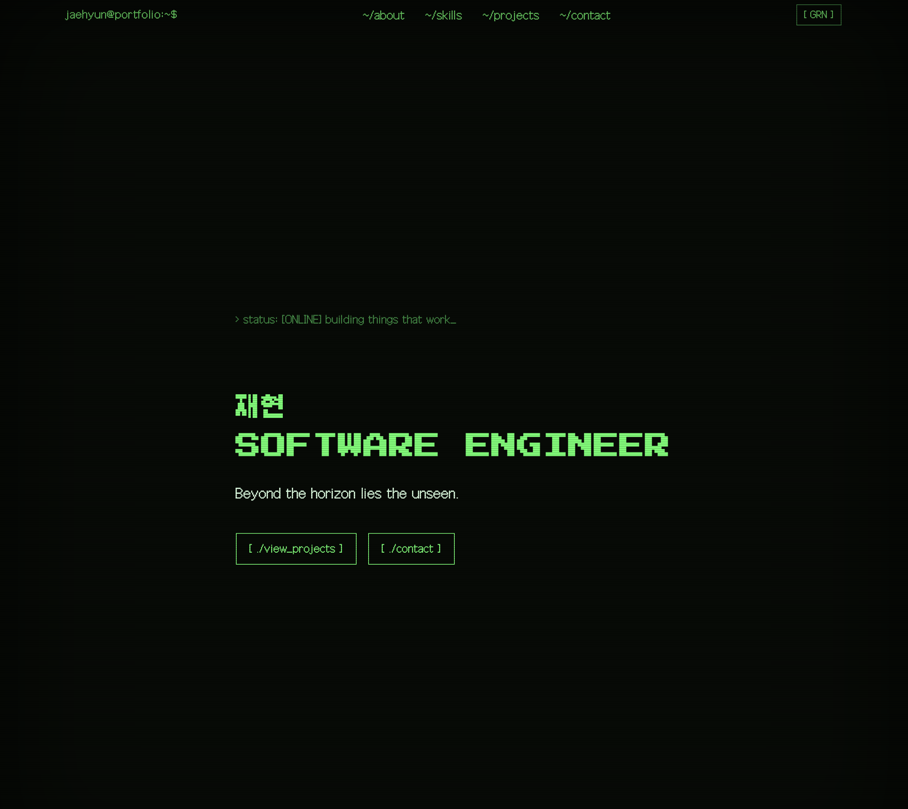
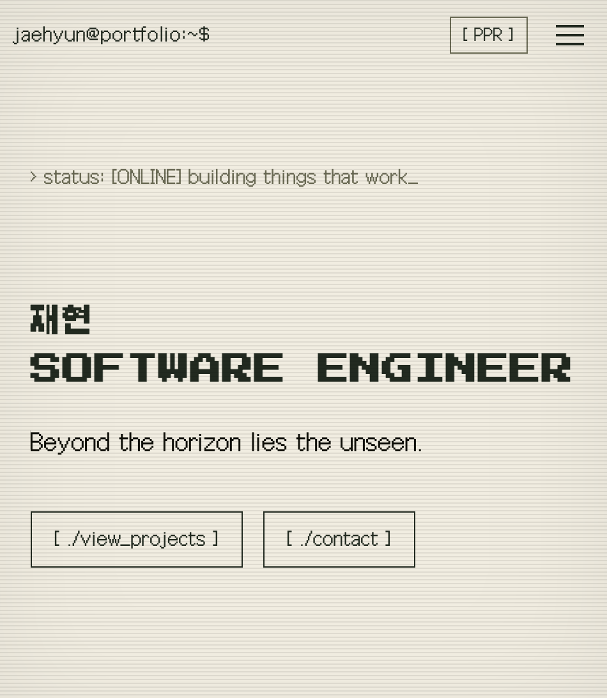
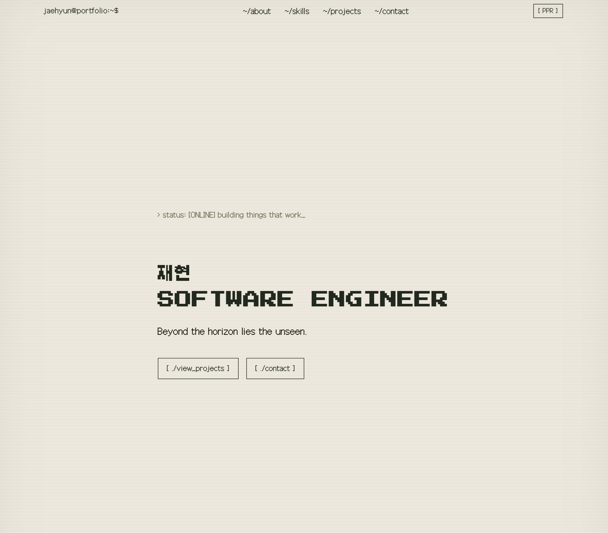

# jaehyun@portfolio

재현의 개발 포트폴리오. 순수 HTML/CSS/JavaScript로 제작한 반응형 웹사이트이며,
CRT 터미널(모노톤 인광) 컨셉으로 디자인했습니다.

## 배포
- 배포 URL: https://sonjehyun123-maker.github.io/Codyssey-B4-1/
- 저장소: https://github.com/sonjehyun123-maker

## 사용 기술
- HTML5 시맨틱 마크업
- CSS3 (Flexbox, Grid, CSS 변수, `[data-theme]` 기반 테마 전환)
- Vanilla JavaScript (ES6+, `fetch`/`async-await`, `IntersectionObserver`)
- GitHub REST API (`/users/{username}/repos`)
- 웹폰트: Press Start 2P(Google Fonts), Galmuri(한글 도트 폰트)

## 디자인 컨셉
1980~90년대 CRT 모니터의 인광(phosphor) 디스플레이에서 착안했습니다.
헤더의 테마 버튼을 누르면 **그린 인광(기본) ↔ 라이트(도트 프린터 용지)**로 전환되며,
상태는 `localStorage`에 저장되어 새로고침 후에도 유지됩니다.

라이트 모드는 크림색 종이 배경 + 짙은 잉크색 텍스트로, 오래된 도트 프린터 영수증에서
착안했습니다. 과제 요구사항의 "다크 모드 토글"이 요구하는 실제 명암 대비(밝은 배경 ↔
어두운 배경)를 이 구조가 그대로 충족합니다.

## 파일을 분리한 이유 (HTML / CSS / JS)
- **HTML (`index.html`)**: 콘텐츠와 구조만 담당. "무엇이 있는가"
- **CSS (`css/style.css`)**: 생김새만 담당. "어떻게 보이는가"
- **JS (`js/main.js`)**: 동작만 담당. "무엇을 하는가"

세 역할을 한 파일에 섞으면(인라인 스타일, 인라인 이벤트) 디자인만 바꾸려 해도 로직을 건드리게 되고 재사용·유지보수가 어려워집니다. 역할별로 분리하면 각자 독립적으로 수정 가능하고, 브라우저가 CSS/JS를 캐싱해서 재방문 시 더 빠르게 로드됩니다.

## Flexbox vs Grid — 차이와 사용처 (CSS)
| | Flexbox | Grid |
|---|---|---|
| 축 | 1차원 (가로 또는 세로 한 줄) | 2차원 (행+열 동시) |
| 적합한 상황 | 요소 개수가 정해져 있고 한 줄 정렬이면 충분할 때 | 개수가 가변적이고 행/열 모두 반응형이어야 할 때 |
| 이 프로젝트에서 | `.nav-bar` (로고 좌/메뉴 우) | `.projects-grid` (`auto-fit, minmax(240px, 1fr)`) |

Projects 섹션은 GitHub API 응답 개수가 매번 다르고, 화면 너비에 따라 한 줄에 들어가는 카드 수도 달라져야 해서 2차원 배치가 필요한 Grid를 썼습니다. 네비게이션은 로고/메뉴/토글 3개 요소를 가로로 한 줄 배치하기만 하면 돼서 Flex로 충분했습니다.

## querySelector → addEventListener 흐름 (JS)
`addEventListener`는 "이 요소에 이런 이벤트가 발생하면 이 함수를 실행해라"를 등록하는 함수입니다. 순서는 항상 같습니다.

1. `document.querySelector('#id')`로 DOM에서 요소를 하나 찾아 변수에 담는다
2. 그 변수에 `.addEventListener('이벤트종류', 콜백함수)`로 반응할 함수를 연결한다
3. 실제로 이벤트(클릭 등)가 발생하면 브라우저가 콜백함수를 실행한다

```js
const themeToggle = document.querySelector('#themeToggle'); // 1. 요소 선택
themeToggle.addEventListener('click', () => {                // 2. 이벤트 연결
  // 3. 클릭될 때마다 이 블록이 실행됨
});
```

## 이벤트 → 상태 변경 → DOM 렌더링 흐름 (JS)
하나의 기능은 항상 3단계로 이어집니다.

1. **이벤트**: 사용자가 뭔가 함 (클릭, 입력, 스크롤...)
2. **상태 변경**: `STATE` 객체의 값을 바꿈 (화면은 아직 안 바뀜)
3. **DOM 렌더링**: `render 함수`가 `STATE`를 읽어서 실제 화면(DOM)에 반영

이렇게 나누면 "지금 상태가 뭔지"랑 "화면에 어떻게 그릴지"가 분리돼서, 상태가 왜 바뀌었는지 추적하기 쉬워집니다.

**예시 1 — 테마 토글**
```js
themeToggle.addEventListener('click', () => {                          // 1. 이벤트
  STATE.theme = THEME_ORDER[(THEME_ORDER.indexOf(STATE.theme) + 1) % THEME_ORDER.length]; // 2. 상태 변경
  localStorage.setItem(THEME_KEY, STATE.theme);
  renderTheme();                                                       // 3. DOM 렌더링
});
```

**예시 2 — 햄버거 메뉴**
```js
hamburger.addEventListener('click', () => {  // 1. 이벤트
  STATE.menuOpen = !STATE.menuOpen;           // 2. 상태 변경
  renderMenu();                               // 3. DOM 렌더링 (classList 토글)
});
```

## fetch + async/await 비동기 처리 (JS)
GitHub API 호출은 응답이 오기까지 시간이 걸리는 비동기 작업입니다. `async/await`로 "응답 올 때까지 기다렸다가 다음 줄 실행"처럼 순차적으로 읽히게 작성했고, 그 사이 상태 변화를 UI로 다음처럼 표현합니다.

| 단계 | STATE.projectsStatus | 화면 |
|---|---|---|
| 요청 시작 | `'loading'` | 깜빡이는 커서 + "로딩 중" |
| 응답 성공 + 데이터 있음 | `'success'` | 카드 리스트 렌더링 |
| 응답 성공 + 빈 배열 | `'empty'` | "표시할 프로젝트가 없습니다" |
| 요청 실패 (403/404/네트워크 등) | `'error'` | 에러 코드 메시지 + `[ retry ]` 버튼 |

```js
const loadProjects = async () => {
  STATE.projectsStatus = 'loading';
  renderProjects();                 // 로딩 상태 먼저 그림
  try {
    const response = await fetch(`https://api.github.com/users/${GITHUB_USERNAME}/repos`);
    if (!response.ok) throw new Error(ERROR_MESSAGES[response.status] ?? `ERR_HTTP_${response.status}`);
    // ... 성공 시 STATE.projectsStatus = 'success' / 'empty'
  } catch (error) {
    STATE.projectsStatus = 'error';
    STATE.projectsError = error instanceof TypeError ? 'ERR_NETWORK: ...' : error.message;
  }
  renderProjects();                 // 최종 상태를 다시 그림
};
```
`try/catch`로 요청 실패(레이트리밋 403, 404, 네트워크 끊김)를 잡아서 각각 구분되는 에러 코드(`ERR_RATE_LIMIT`, `ERR_NOT_FOUND`, `ERR_NETWORK`, `ERR_HTTP_*`)로 표시합니다.

## 상태 → 렌더링 흐름 (전체 목록)
1. 테마 토글 클릭 → `STATE.theme` 변경 → `renderTheme()` (localStorage 유지)
2. 햄버거 클릭 → `STATE.menuOpen` 변경 → `renderMenu()`
3. 스크롤 → `STATE.scrolled` / `showScrollTop` 변경 → `renderHeader()`
4. GitHub API 호출 → `STATE.projectsStatus` / `projects` 변경 → `renderProjects()`
5. 폼 입력/제출 → `STATE.formErrors` 변경 → `renderFormErrors()`

## 주요 기준값
- 스크롤 300px 이상 → 맨 위로 버튼 노출
- 스크롤 60px 이상 → 네비게이션 배경 전환
- IntersectionObserver threshold: 0.2


## 스크린샷
| 데스크톱 | 모바일 | 앰버 모드 |
|---|---|---|
| |  |  |

## 폴더 구조
```
.
├── index.html
├── css/style.css
├── js/main.js
└── images/image.svg
```